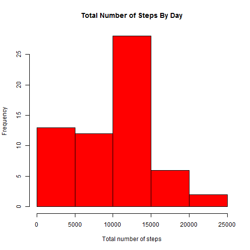
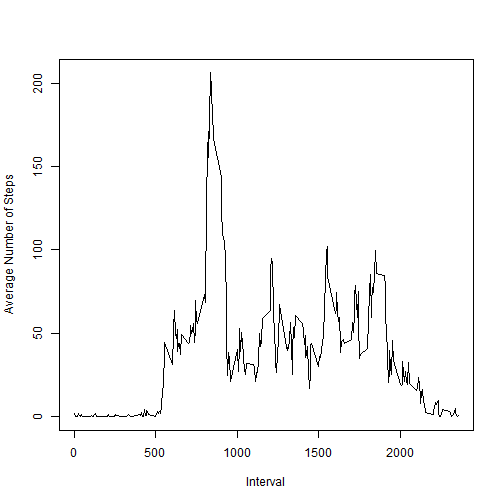
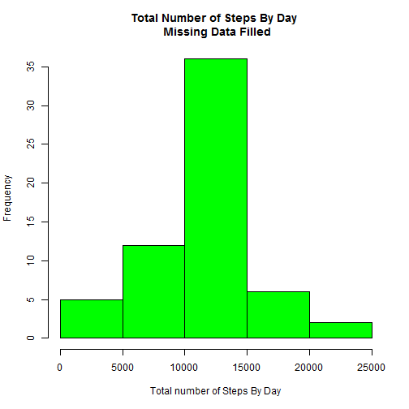
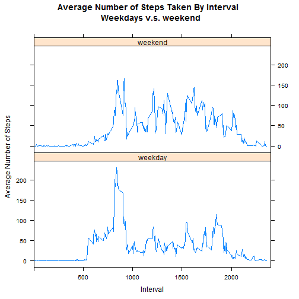

# Introduction
This report is to analyze the data of the number of steps one person generated 
at 5 mininute interval over October and November 2012 and find interesting 
patterns in the data.

# Methods
The main method used in this report is to perform exploratory data analysis by 
checking some summaries of the data and plotting some graphs to show interesting
trends.  
**R** is used as the main tool to perform the analysis.

## Loading and preprocessing the data
The original data is from 
[activity.zip](https://github.com/rdpeng/RepData_PeerAssessment1/blob/master/activity.zip).

Assume the activity.zip is downloaded to the same directory where this report 
locates, the following actions are performed:  
  - The zip file is unzipped  
  - The unzipped file content is loaded into **data** variable  
  - The **interval** column is processed so that the values can represent time in an 
 easy-to-parse format for future analysis  
    - Basically 0s are padded to the left of the original value, so "0" -> "0000" 
   which means 00:00, and "855" -> "0855" which means 08:55. If the original values
   are already 4 digits, they are not changed, like "1010" -> "1010".  

```r
unzip("activity.zip")
unzippedFileName <- list.files(pattern = ".csv")
data <- read.csv(unzippedFileName, stringsAsFactors = FALSE)
data$interval <- sapply(data$interval, function(i) sprintf("%04d",i))
```

## What is mean total number of steps taken per day?
In this analysis, all the **NA** values are removed from the data.  

The following chart is a histogram of the total number of steps taken each day.

```r
totalNumberOfStepsByDay <- with(data, tapply(steps, date, sum, na.rm = T))
hist(totalNumberOfStepsByDay, col = "red", 
    main = "Total Number of Steps By Day", xlab = "Total number of steps")
```

 

The **mean** of the number of steps taken per day is:

```r
mean(totalNumberOfStepsByDay)
```

```
## [1] 9354.23
```

The **median** of the number of steps taken per day is:

```r
median(totalNumberOfStepsByDay)
```

```
## [1] 10395
```

## What is the average daily activity pattern?
In this analysis, all the **NA** values are removed from the data.  

The following chart shows the 5-minute interval (x-axis) and the average number
of steps taken averaged across all days (y-axis).

```r
averageNumberOfStepsByInterval <- with(data, tapply(steps, interval, mean, na.rm = T))
# To make the plot() function respect the type parameter, 
# the x-axis values cannot be of type factor.
plotData <- data.frame(
    interval = names(averageNumberOfStepsByInterval), 
    mean = averageNumberOfStepsByInterval, stringsAsFactors = FALSE)
plot(plotData$interval, plotData$mean, type = "l", 
     xlab = "Interval", ylab = "Average Number of Steps")
```

 

The following 5-minute interval contains the maximum number of steps, on average
across all the days:

```r
maxNumberOfSteps <- max(plotData$mean)
maxData <- subset(plotData, mean == maxNumberOfSteps)
maxData$interval
```

```
## [1] "0835"
```

## Imputing missing values
The total number of missing values in the dataset is:

```r
sum(is.na(data))
```

```
## [1] 2304
```

To avoid possible bias in the analysis, the missing values in the dataset are 
replaced by the average value of that interval across all the days in the dataset.

```r
filledStepsData <- apply(data, 1, 
    function(x) x[1] <- ifelse(is.na(x[1]), subset(plotData, interval == x[3])$mean, x[1]))
```

A new data set is created with the missing data filled in the orignal data and 
is stored in **newData** variable.

```r
newData <- data
newData$steps <- as.numeric(filledStepsData)
```

The following chart is a histogram of the total number of steps taken each day,
for the new data set.

```r
totalNumberOfStepsByDayNew <- with(newData, tapply(steps, date, sum, na.rm = T))
hist(totalNumberOfStepsByDayNew, col = "green", 
    main = "Total Number of Steps By Day \n Missing Data Filled", 
    xlab = "Total number of Steps By Day")
```

 

The **mean** of the number of steps taken per day for the new data set is:

```r
mean(totalNumberOfStepsByDayNew)
```

```
## [1] 10766.19
```

The **median** of the number of steps taken per day for the new data set is:

```r
median(totalNumberOfStepsByDayNew)
```

```
## [1] 10766.19
```

From the analysis, it is clear that:  
  - The **mean** and **median** values differ from those in the original data set.    
  - The impact is that the distribution looks more like a normal distribution.  

## Are there differences in activity patterns between weekdays and weekends?
In this analysis, the new data set with no missing values are used.  

The first thing is to create a new column **IsWeekday** with two levels 
("weekday" and "weekend") so that the data can be conditioned based on this 
column later.

```r
newFactor <- sapply(
    newData$date, 
    function(d) ifelse((weekdays(as.Date(d)) == "Saturday" | weekdays(as.Date(d)) == "Sunday"), "weekend", "weekday"))
newData$IsWeekday <- newFactor
```

The new data set is then grouped on IsWeekday and interval columns, and the 
average of the steps on each group is calculated.  

```r
library(dplyr)
groupedData <- group_by(newData, IsWeekday, interval)
summarziedData <- summarise(groupedData, steps = mean(steps))
```

Then a panel plot with the 5-minute interval (x-axis) and the average number of 
steps taken averaged across all weekdays or weekend days (y-axis) is created.  
  - xyplot in lattice plotting system is used here since it fits the conditioning
  plotting perfectly.

```r
library(lattice)
xyplot(steps ~ interval | IsWeekday , data=summarziedData, 
       main="Average Number of Steps Taken By Interval \n Weekdays v.s. weekend", 
       xlab="Interval",  ylab="Average Number of Steps",
       layout=c(1,2), type="l", xlim = c(0,2400))
```

 

From the chart, it is clear that:  
  - During the weekday, **around 08:35 is the peak activity time**, and the rest of 
  day has much less activity.  
  - During the weekend, there is **no significant peak activity time**, and from 08:00
  to 20:00 the activity level is generally **higher** than that of the weekdays.
